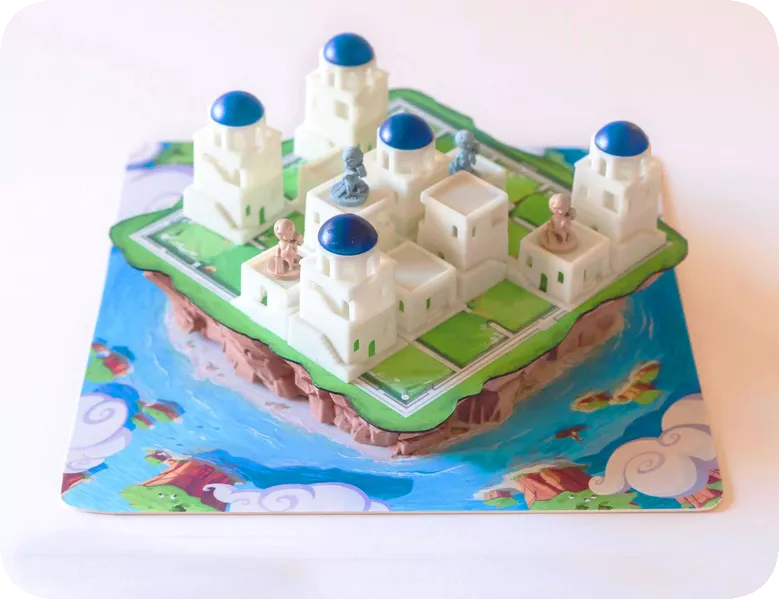

<!-- markdownlint-disable MD033 -->
<!-- markdownlint-disable MD034 -->
# Santorini

<p align="center">
  
</p>

<p align="center">
Physical Game with blocks and pawns
</p>

<br>

> Santorini is an **accessible strategy game**, **simple** enough for an elementary school classroom **while aiming to provide gameplay depth** and content for hardcore gamers to explore, The rules are simple. <u>Each turn consists of 2 steps</u>:
>
> **1. Move** - move one of your builders into a neighboring space. You may move your Builder Pawn on the same level, step-up one level, or step down any number of levels.
>
> **2. Build** - Then construct a building level adjacent to the builder you moved. When building on top of the third level, place a dome instead, removing that space from play.
>
> **Winning the game** - If either of your builders reaches the third level, you win.
>
> **Variable player powers** - Santorini features variable player powers layered over an otherwise abstract game, with 40 thematic god and hero powers that fundamentally change the way the game is played.

https://user-images.githubusercontent.com/53702616/129211826-644cc233-c0f4-4108-8463-6d328967cc3f.mp4

## Dependencies

The project has been developed under Java 13 and JavaFX 11.
Any Java version > 13 should be able to run the game (tested up to Java 15).

## How to run

An already compiled jar is available at ```/deliveries/final/jar```

The jar is unique and can start the **CLI**, the **GUI** and the **SERVER** with the correct arguments.

The default run configuration for the jar is set on the GUI.

Double clicking the jar from a Window Manager will launch directly the GUI.

Executing the jar on the command line from bash or cmd with ```--help``` parameter displays the following:

```shell
Usage: java -jar santorini.jar [OPTION]...
Launching without options will load the Graphical User Interface (GUI)

-S, --server        starts a server on localhost, if no port is specified it will be 34567
-P, --port          specifies the server port (checked only if --server option is called)
-C, --cli           starts a new client with Command Line Interface (CLI)
```

### How to run under linux

Linux support for JavaFX 3D is still in beta, to run the game with a GUI under linux you need to execute the jar with the following parameters:

```shell script
java -Dprism.forceGPU=true -jar santorini.jar
```
